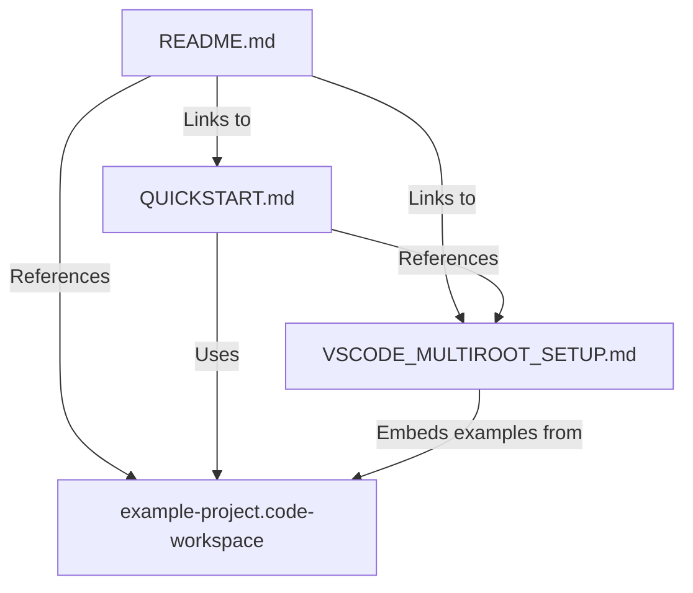

# System Patterns: VS Code Multi-Root Workspace Documentation

## Architecture Overview

This is a **documentation-only project** with no executable code. The architecture consists of:
1. Documentation files (Markdown)
2. Configuration files (JSON)
3. Memory Bank (project knowledge base)

```
AI_Notes_Services/
├── README.md                          # Entry point and navigation
├── QUICKSTART.md                      # 5-minute setup guide
├── VSCODE_MULTIROOT_SETUP.md         # Comprehensive guide
├── example-project.code-workspace     # Sample JSON configuration
├── memory-bank/                       # Project knowledge base
│   ├── projectbrief.md
│   ├── productContext.md
│   ├── systemPatterns.md             # This file
│   ├── techContext.md
│   ├── activeContext.md
│   └── progress.md
└── .git/                              # Version control
```

## Documentation Structure

### Layered Information Architecture

The documentation follows a **progressive disclosure** pattern:

```
README.md (Overview & Navigation)
    ↓
QUICKSTART.md (5-min setup, essential info)
    ↓
VSCODE_MULTIROOT_SETUP.md (Complete reference)
    ↓
example-project.code-workspace (Working config)
```

**Pattern**: Each layer assumes less prior knowledge and provides more detail.

### File Relationships



## Key Design Patterns

### 1. Example-Driven Documentation

**Pattern**: Show complete, working examples rather than abstract descriptions.

**Implementation**:
- Full `.code-workspace` JSON configuration with inline comments
- Complete debug configurations for all platforms
- Full task definitions with Windows/Mac variants
- Real extension IDs that can be copy-pasted

**Benefits**:
- Users can copy-paste and adapt
- Reduces ambiguity
- Demonstrates best practices through examples

### 2. Emoji-Enhanced Navigation

**Pattern**: Use emojis consistently to create visual landmarks.

**Implementation**:
- 🌐 Web Frontend
- 🤖 Android App  
- 🍎 iOS App
- 📦 Shared
- ⚡ Quick Start
- 📖 Complete Guide
- 🔧 Configuration

**Benefits**:
- Rapid visual scanning
- Makes technical content more approachable
- Consistent visual language throughout

### 3. Multi-Level Troubleshooting

**Pattern**: Provide troubleshooting at each documentation level.

**Implementation**:
- QUICKSTART.md: Quick fixes for common issues
- VSCODE_MULTIROOT_SETUP.md: Detailed troubleshooting section
- Both include: Problem → Solutions structure

**Benefits**:
- Users find help at their current depth level
- Reduces support burden
- Builds user confidence

### 4. Checklist-Driven Verification

**Pattern**: Provide actionable checklists throughout.

**Implementation**:
- Setup verification checklist (QUICKSTART.md)
- Customization checklist (QUICKSTART.md)
- Getting started checklist (README.md)
- Next steps checklist (VSCODE_MULTIROOT_SETUP.md)

**Benefits**:
- Clear success criteria
- Nothing gets forgotten
- Builds systematic approach

### 5. Platform-Specific Guidance

**Pattern**: Acknowledge platform differences explicitly.

**Implementation**:
- Separate sections for Web, Android, iOS tips
- Windows vs macOS command variants
- Platform-specific requirements clearly stated
- "When to use X vs Y" guidance (e.g., VS Code vs Xcode)

**Benefits**:
- Reduces confusion
- Sets realistic expectations
- Prevents wasted effort

## Configuration Architecture

### Workspace File Structure

The `.code-workspace` file follows this pattern:

```json
{
  "folders": [],        // Project folder definitions
  "settings": {},       // Workspace-wide settings
  "extensions": {},     // Extension recommendations
  "launch": {},         // Debug configurations
  "tasks": {}          // Automated tasks
}
```

### Settings Hierarchy

VS Code settings work in a hierarchy:

```
User Settings (global)
    ↓
Workspace Settings (applies to all folders)
    ↓
Folder Settings (.vscode/settings.json per folder)
```

**Our Pattern**: Put shared preferences in workspace settings, platform-specific in folder settings.

### Extension Recommendations

**Pattern**: Embed extension recommendations in workspace file.

```json
{
  "extensions": {
    "recommendations": [
      "publisher.extension-id"  // VS Code will prompt to install
    ]
  }
}
```

**Benefits**:
- New team members get prompted automatically
- One source of truth for required extensions
- Version controlled with workspace

### Debug Configurations

**Pattern**: Use `${workspaceFolder:FolderName}` for multi-root navigation.

```json
{
  "name": "Debug Android",
  "apkFile": "${workspaceFolder:🤖 Android App}/app/build/outputs/apk/debug/app-debug.apk"
}
```

**Critical Detail**: Must use exact folder name from `folders` array.

### Task Organization

**Pattern**: Create tasks per platform with descriptive labels.

```json
{
  "label": "Build Android Debug APK",  // Clear, searchable name
  "command": "./gradlew assembleDebug",
  "windows": {
    "command": ".\\gradlew.bat assembleDebug"  // Platform variant
  },
  "options": {
    "cwd": "${workspaceFolder:🤖 Android App}"  // Correct context
  }
}
```

## Content Organization Patterns

### Table of Contents Pattern

**Pattern**: Every long document starts with clickable TOC.

**Implementation**: Markdown anchors for navigation
```markdown
## Table of Contents
1. [Section One](#section-one)
2. [Section Two](#section-two)
```

**Benefits**:
- Quick navigation in long documents
- Shows document structure upfront
- Reduces scrolling

### Section Separator Pattern

**Pattern**: Use `---` horizontal rules to separate major sections.

**Benefits**:
- Visual breaks improve readability
- Clear section boundaries
- Professional appearance

### Code Block Language Tags

**Pattern**: Always specify language for syntax highlighting.

```markdown
```json  ← Always specify
{
  "setting": "value"
}
``` 
```

**Benefits**:
- Better readability
- Proper syntax highlighting
- Professional presentation

## Documentation Maintenance Patterns

### Single Source of Truth

**Pattern**: The `.code-workspace` file is the canonical example.

**Implementation**: 
- VSCODE_MULTIROOT_SETUP.md embeds excerpts from it
- QUICKSTART.md references it
- README.md points to it

**Benefits**:
- No conflicting examples
- Easy to update (change one file)
- Users get working configuration

### Version Dating

**Pattern**: Include "Last Updated" date in main documents.

**Implementation**: Footer in README.md shows "Last Updated: November 2025"

**Benefits**:
- Users know if info might be outdated
- Signals active maintenance
- Helps prioritize updates

## Critical Implementation Paths

### User Path 1: Quick Setup (5 minutes)
1. User reads README.md
2. Opens QUICKSTART.md
3. Copies example-project.code-workspace
4. Edits paths in JSON
5. Opens in VS Code
6. Installs extensions
7. Starts working

### User Path 2: Deep Learning
1. User reads README.md
2. Skims QUICKSTART.md for overview
3. Reads VSCODE_MULTIROOT_SETUP.md thoroughly
4. References example-project.code-workspace while reading
5. Customizes workspace extensively
6. Returns to docs for troubleshooting

### User Path 3: Team Onboarding
1. Team lead shares repository
2. New developer reads README.md
3. Follows QUICKSTART.md
4. Opens shared .code-workspace file
5. Gets prompted for extension installation
6. Everything works immediately

## Design Decisions

### Why JSON with Comments?
- VS Code supports JSONC (JSON with Comments)
- Comments explain each setting inline
- More maintainable than separate documentation
- Users can delete comments if desired

### Why Emojis in Folder Names?
- Visual differentiation in sidebar
- Memorable and distinctive
- Modern, friendly appearance
- Easy to spot at a glance

### Why Three Documentation Levels?
- Different users have different needs
- Progressive disclosure reduces overwhelm
- Quick start for impatient users
- Deep dive for thorough learners
- Reference for returning users

### Why Include iOS Despite macOS Requirement?
- Many teams do cross-platform development
- Better to include with caveat than exclude
- Documentation is still useful for Mac users
- Shows complete multi-platform picture

### Why Relative Paths in Examples?
- Portability across team members
- Works when workspace is in different locations
- Encourages project organization
- Easier for beginners to understand

## Anti-Patterns Avoided

❌ **Don't**: Separate debugging instructions from setup
✅ **Do**: Include debugging in comprehensive guide

❌ **Don't**: Assume user knows VS Code deeply
✅ **Do**: Explain keyboard shortcuts and features

❌ **Don't**: Only provide JSON without explanation
✅ **Do**: Include both working config and detailed guide

❌ **Don't**: Mix mobile platforms (native vs React Native)
✅ **Do**: Focus clearly on native development

❌ **Don't**: Generic "development workspace" guidance
✅ **Do**: Specific Web + Android + iOS configuration
